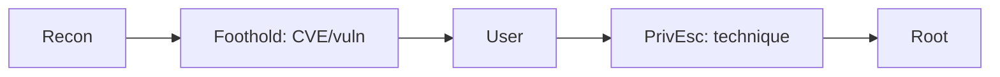

# <Target Name>

| | |
|---|---|
| **Platform** | HTB / CTF / Bug bounty |
| **OS** | Linux / Windows |
| **Difficulty** | Easy / Medium / Hard / Insane |
| **Status** | Retired ✅ / Disclosed ✅ |
| **Tags** | `web` `privesc` `...` |
| **Date** | YYYY-MM-DD |

> One-line summary of the box: the shortest path from `nmap` to `root`.

---

## 0. TL;DR — Attack chain



1. **Foothold** — <how initial access was gained>
2. **User** — <what got the user flag>
3. **PrivEsc** — <how root was reached>

---

## 1. Recon

```bash
# Full TCP port scan
nmap -p- --min-rate 5000 -T4 <IP> -oN nmap/allports.txt

# Service/version + default scripts on open ports
nmap -sCV -p <ports> <IP> -oN nmap/services.txt
```

**Findings:**
- `port/service` → <notes>

---

## 2. Enumeration

```bash
# Directory / vhost / etc.
gobuster dir -u http://<IP>/ -w <wordlist> -x php,txt
```

<What was found and why it matters.>

---

## 3. Foothold

> Concept first (what the vulnerability is and why it works), then the exact commands.

```bash
# exploitation command(s)
```

**Result:** shell as `<user>`.

```bash
cat user.txt
```

---

## 4. Privilege Escalation

> Concept: <what misconfiguration / CVE / primitive is abused>.

```bash
# enumeration that revealed the vector (linpeas, sudo -l, etc.)
# then the escalation
```

**Result:** shell as `root` / `SYSTEM`.

```bash
cat root.txt
```

---

## 5. Attack chain — full walkthrough

<Step-by-step narrative of the whole chain, how each stage connected to the next, and what it means conceptually. This is the part that turns a solve into learning.>

---

## 6. Remediation

- <fix for the foothold vuln>
- <fix for the privesc vector>

---

## 7. Lessons / notes

- <what was new, what to remember, tooling notes>

---

## References

- <CVE / advisory / docs links>
