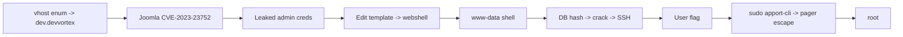

# Devvortex

| | |
|---|---|
| **Platform** | HTB |
| **OS** | Linux |
| **Difficulty** | Medium |
| **Status** | Retired ✅ |
| **Tags** | `web` `vhost` `joomla` `cve` `password-cracking` `sudo` |

> A hidden dev vhost runs Joomla with an unauthenticated config-disclosure CVE. Leaked credentials → admin → template RCE → user, then a `sudo apport-cli` pager escape → root.

---

## Attack chain

---

## Recon — the hidden vhost

The main site is a static page. **Virtual-host enumeration** ("перебор виртуальных хостов") uncovers a development subdomain (`dev.devvortex.htb`) that serves a Joomla CMS — content that only appears when you send the right `Host` header.

## Foothold — Joomla CVE-2023-23752

This Joomla version exposes an unauthenticated REST API endpoint that returns the site configuration, **including the database username and password**. Those credentials are reused for the Joomla administrator login.

## Foothold to shell — template RCE

With admin access, Joomla lets you edit a template's PHP directly. Writing PHP into a template file and requesting it executes code on the server → shell as `www-data`.

## User

The database holds a hashed password for the user `logan` (a bcrypt hash). Cracked offline, the plaintext works for SSH → **user** flag.

## Privilege escalation — apport-cli pager escape

`sudo -l` shows `logan` can run **apport-cli** (Ubuntu's crash-report tool) as root. Viewing a crash report pipes output through a pager (`less`); from the pager you spawn a shell, which — because apport-cli ran under `sudo` — is root → **root**. (Related hardening: CVE-2023-1326.)

---

## Why it works

Same pattern twice: secrets that should never be reachable (a config API returning DB creds) and a "read-only looking" root tool that actually drops you into an interactive pager. Config endpoints and diagnostic tools are classic overlooked attack surface.

## Remediation

- Patch Joomla; restrict/authenticate the config API; don't reuse DB creds for admin logins.
- Lock down template editing in production.
- Avoid `sudo` on tools that open a pager; update apport.

## References

- CVE-2023-23752 — Joomla unauthenticated information disclosure
- GTFOBins — pager/`less` escapes
