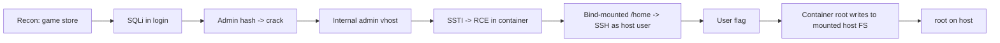

# GoodGames

| | |
|---|---|
| **Platform** | HTB |
| **OS** | Linux |
| **Difficulty** | Easy |
| **Status** | Retired ✅ |
| **Tags** | `web` `sqli` `ssti` `password-reuse` `docker-escape` |

> SQL injection leaks the admin hash, an internal panel is vulnerable to SSTI for RCE inside a container, and a bind-mounted home directory plus password reuse bridges container → host → root.

---

## Attack chain

---

## Foothold — SQL injection

The main login is vulnerable to **SQL injection**. Bypassing authentication and extracting the admin account reveals a password hash; cracking it offline recovers the admin's plaintext password.

## Pivot to the internal panel — SSTI

The admin credentials unlock an internal administration vhost (a separate host header, served on an internal port). Its profile/settings page reflects a user-controlled field straight into a server-side template — **Server-Side Template Injection** ("внедрение в серверный шаблон"). A template payload evaluates on the server and yields **RCE**, dropping a shell that is *root inside a Docker container*.

## User — container to host

Being root in a container is not root on the box. Inspecting the container shows the host user's home directory is **bind-mounted** in. The host user reuses the admin password, so SSH to the host succeeds → **user** flag.

## Privilege escalation — the mount is the escape

Back in the container (where you are root), the mounted host directory is writable *as root*. You drop a root-owned SUID copy of a shell into that shared path. On the host, the low-privileged user runs it; because the file is owned by root with the SUID bit, it grants a root shell on the host → **root**.

---

## Why it works

A container boundary is only as strong as what crosses it. A writable bind mount shared between "container root" and "host user" collapses the isolation: root on one side becomes root on the other. Password reuse is the glue that lets you move between the two identities.

## Remediation

- Parameterise all queries; never concatenate input into SQL.
- Sandbox/auto-escape template engines; never render user input as a template.
- Don't reuse passwords across accounts; mount host paths read-only and drop container capabilities/SUID.

## References

- OWASP: SQL Injection, Server-Side Template Injection
- Docker security — bind mounts & capabilities
