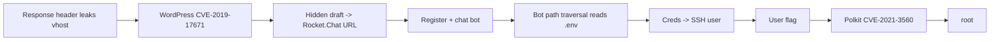

# Paper

| | |
|---|---|
| **Platform** | HTB |
| **OS** | Linux |
| **Difficulty** | Easy |
| **Status** | Retired ✅ |
| **Tags** | `web` `wordpress` `cve` `rocketchat` `path-traversal` `polkit` |

> A leaked response header points to a secret WordPress vhost. A draft-disclosure CVE reveals a Rocket.Chat link; the chat bot leaks credentials via path traversal; and Polkit CVE-2021-3560 gives root.

---

## Attack chain

---

## Recon — the header that talks too much

The default page is unremarkable, but an HTTP response header leaks an internal backend name, revealing a secret virtual host (`office.paper`). Adding it exposes a WordPress site.

## Foothold — WordPress draft disclosure (CVE-2019-17671)

This WordPress version lets an unauthenticated visitor view **unpublished/draft** sontent through a static query parameter. A hidden draft mentions a private employee chat and a **Rocket.Chat** registration URL (`chat.office.paper`).

## Lateral — the chat bot

You self-register on Rocket.Chat and find an assistant bot (`recyclops`) that answers commands. One command reads/lists files relative to a base directory, but it doesn't sanitise paths — a **path-traversal** ("выход за пределы каталога") lets you climb out and read arbitrary files, including the bot's `.env`, which contains a user's password.

## User

That password works for SSH as the user → **user** flag.

## Privilege escalation — Polkit (CVE-2021-3560)

The host runs a version of **polkit/pkexec** vulnerable to CVE-2021-3560: a race in `dbus`/polkit authentication lets a local user register a privileged account or execute an action as root. Triggering it yields a root shell → **root**.​

---

## Why it works

Information leaks stack: a header exposes a vhost, a CMS exposes drafts, and a draft exposes a chat. Then an over-trusting bot (no path sanitisation) hands over secrets, and an unpatched local component (polkit) finishes it. Every step is "something exposed a bit more than intended."

## Remediation

- Strip identifying backend headers; patch WordPress; don't keep secrets in drafts.
- Sanitise/normalise any file path a bot accepts; keep secrets out of readable `.env`.
- Patch polkit (CVE-2021-3560) and keep the base OS current.

## References

- CVE-2019-17671 — WordPress unauthenticated draft/private post view
- CVE-2021-3560 — polkit local privilege escalation
