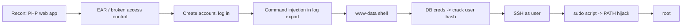

# Previse

| | |
|---|---|
| **Platform** | HTB |
| **OS** | Linux |
| **Difficulty** | Medium |
| **Status** | Retired ✅ |
| **Tags** | `web` `broken-access-control` `command-injection` `password-cracking` `path-hijack` |

> A PHP app that renders protected pages *before* enforcing the login redirect. That single flaw opens the door to a command-injection foothold, and a sloppy `sudo` script finishes the job with a PATH hijack.

---

## Attack chain

---

## Foothold — Execution After Redirect (EAR)

The site protects its internal pages with a login redirect, but the server keeps building and sending the full page body *after* issuing the `302`. The browser follows the redirect and hides it, but the response already contains the "protected" content. By stopping the redirect from being followed, an unauthenticated visitor reaches the account-creation page and registers a valid account.

This is **Execution After Redirect** — "выполнение после редиректа": the redirect is cosmetic, not an access-control boundary. Authorization must happen *before* any protected logic runs, not after.

## From foothold to shell — command injection

Logged in, the app exposes a log-management feature that lets you export logs. One parameter that controls the output format ("delimiter") is passed into a backend OS command without sanitisation. Injecting shell metacharacters turns the export into arbitrary command execution, giving a reverse shell as `www-data`.

## User

On disk, the app's config file holds the MySQL credentials. Dumping the users table yields a password hash for the account `m4lwhere`. The hash is a crackable format ("MD5crypt") — an offline dictionary attack recovers the plaintext, which is reused for SSH. That lands the **user** flag.

## Privilege escalation — PATH hijacking

`m4lwhere` is allowed via `sudo` to run a maintenance/backup script as root. The script invokes helper binaries by their bare name instead of absolute paths. Because `sudo` here preserves a controllable `PATH`, you place a malicious file with the same name as one of those binaries in a writable directory, put that directory first in `PATH`, and run the script. Root executes *your* file → **root**.

---

## Why it works

Two recurring themes: trusting the client to honour a redirect (access control that isn't enforced server-side), and trusting the environment (`PATH`) inside a privileged context. Both are "the check happens in the wrong place" bugs.

## Remediation

- Enforce authorization server-side and `exit()` immediately on an unauthenticated request — never render protected content before the redirect completes.
- Never build shell commands from user input; use parameterised APIs or strict allow-lists.
- In `sudo` scripts, call every binary by absolute path and reset `PATH` (`secure_path`).

## References

- OWASP: Execution After Redirect (EAR)
- GTFOBins — PATH abuse patterns
