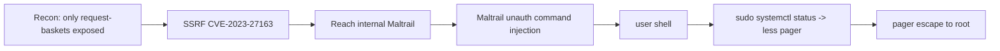

# Sau

| | |
|---|---|
| **Platform** | HTB |
| **OS** | Linux |
| **Difficulty** | Easy |
| **Status** | Retired ✅ |
| **Tags** | `web` `ssrf` `rce` `sudo` `pager-escape` |

> An exposed *request-baskets* instance whose SSRF reaches an internal *Maltrail* service. Maltrail's unauthenticated command injection gives the foothold, and a `sudo systemctl` pager escape gives root.

---

## Attack chain

---

## Recon

Most ports are filtered; the only thing reachable is a *request-baskets* web app on a high port. Everything interesting lives behind it, on the host's internal interface.

## Foothold — SSRF (CVE-2023-27163)

request-baskets can "forward" incoming requests to another URL. The forwarding target isn't restricted, so it becomes a **Server-Side Request Forgery** ("подделка запроса на стороне сервера") primitive: you make the server itself request internal addresses you can't reach directly. Pointing it at `localhost` exposes an internal *Maltrail* service that was never meant to face the outside.

## From SSRF to shell — Maltrail RCE

The internal Maltrail version has an unauthenticated **OS command injection** in the login handling: the submitted username is passed into a subprocess call. Injecting shell metacharacters through the SSRF tunnel executes commands on the host and returns a shell as the service user → **user** flag.

## Privilege escalation — pager escape

`sudo -l` shows the user may run `systemctl status` on a service as root. `systemctl` pipes long output through a pager (`less`). If the terminal is interactive, `less` opens in its own screen, and from inside `less` you can spawn a shell (the pager's shell-escape). Because `systemctl` was launched by `sudo`, that shell runs as root → **root**.​

---

## Why it works

Two "trusted internal" assumptions break: the network trusts request-baskets to only talk outward (SSRF crosses that boundary), and `sudo` trusts that "just showing status" is harmless — but any command that shells out to an interactive pager hands you a root shell.

## Remediation

- Patch request-baskets; block/allow-list SSRF forwarding targets, deny link-local/loopback ranges.
- Keep Maltrail updated; never pass request fields into shell calls.
- Avoid granting `sudo` on commands that invoke a pager; set `sudo` env to disable pagers or use `--no-pager`.

## References

- CVE-2023-27163 — request-baskets SSRF
- Maltrail unauthenticated RCE advisory
- GTFOBins — `systemctl` / `less`
