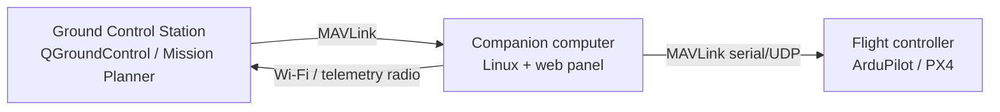

# Attacking Drone / GCS Stacks — a methodology

*Sanitized notes. General technique only — no target-specific details, no flags. For education and authorized testing.*

| | |
|---|---|
| **Domain** | UAV / robotics / ICS |
| **Focus** | MAVLink, ground-control & companion-computer attack surface |
| **Tags** | `mavlink` `iot` `command-injection` `pivoting` |

---

## The stack you're attacking

A typical small-UAV deployment has three layers, and each is a different kind of target:

- **Ground Control Station (GCS)** — the operator's app.
- **Companion computer** — a Linux SBC (Raspberry Pi class) bridging the network to the flight controller; often runs a **web management panel** (e.g. Rpanion-style). This is usually the softest target.
- **Flight controller** — runs the autopilot firmware, speaks MAVLink.

## MAVLink — the protocol assumption to exploit

**MAVLink** ("протокол телеметрии/команд БПЛА") is the lightweight messaging protocol linking these components. Its core design assumption is a *trusted link*: classic MAVLink v1 has **no authentication and no encryption**. On a network you can reach, that means:

- **Passive:** sniff telemetry (position, battery, mode, parameters) — pure information disclosure.
- **Active:** *inject* MAVLink messages. If you can put packets on the link, the flight controller generally trusts them — mode changes, arming/disarming, parameter writes, waypoint/mission overwrite, or a manual-control stream. MAVLink v2 adds optional message signing; when it's absent or the key leaks, injection is back on the table.

So the first questions are always: **can I reach a MAVLink endpoint** (a UDP port such as the common `14550`, a telemetry-radio bridge, or a Wi-Fi link), and **is signing enforced?**

## Where the foothold usually comes from — the companion computer

You rarely start with raw link access. You start with the **web panel** on the companion computer, and it's ordinary web security from there:

- **Command injection** in a management endpoint that shells out (network config, service control, diagnostics that call system tools with user input) → code execution on the SBC.
- Default/weak credentials, exposed config, or an unauthenticated API.

Once you have code execution on the companion computer you are *on the MAVLink link* — the trust boundary is now behind you. From there the pattern is: harvest secrets on the box (SSH keys, saved creds, tokens), then **pivot** deeper into the robotics segment (see the pivoting note).

## The typical chain

1. **Recon** — map the segment; find the GCS, the companion computer's web panel, and any MAVLink UDP/telemetry endpoints.
2. **Foothold** — exploit the companion-computer panel (command injection / weak auth) for code execution.
3. **Loot & pivot** — steal SSH keys / creds from the SBC; move to the next host or the flight-controller network.
4. **MAVLink actions** — with link access and no signing, read or inject messages (telemetry, parameters, mode/commands) as the scenario requires.

## Why it works

Everything hinges on *trusted-link* assumptions carried over from the days when these radios were physically isolated. Put an attacker on the same network segment — via a web bug on the companion computer — and the unauthenticated protocol behind it does the rest.

## Defense

- Enforce **MAVLink v2 message signing**; treat the link as hostile, not trusted.
- Segment the robotics/telemetry network; don't expose companion-computer panels; patch them and kill command-injection sinks.
- Strong auth on every management interface; no default credentials; rotate and protect SSH keys.

## References

- MAVLink protocol & message-signing documentation
- ArduPilot / PX4 security guidance
- OWASP: OS Command Injection
