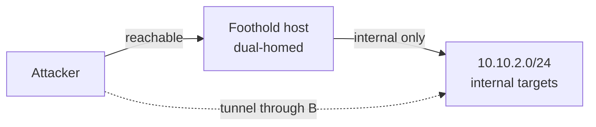

# Pivoting into Internal Networks — a methodology

*Sanitized notes. General technique only — no target-specific details, no flags. For education and authorized testing.*

| | |
|---|---|
| **Domain** | Post-exploitation / lateral movement |
| **Focus** | Reaching networks that aren't routable from your box |
| **Tags** | `pivoting` `tunneling` `chisel` `socat` `ssh` `proxychains` |

---

## The problem

You have a shell on a foothold host. It has a second interface (or firewall rules) that let it reach an internal subnet your attacking machine cannot touch. **Pivoting** ("разворот через захваченный хост") turns that foothold into a router so your tools reach the internal targets.

## Choosing the primitive

Pick the smallest thing that solves the reach problem:

- **One remote service, one local port** → a simple **port relay**. `socat` (or SSH local forward `-L`) maps `attacker:PORT` → `internal_host:PORT`. Cheap, precise, great when you only need one service.
- **Many hosts / many ports** → a **SOCKS proxy** into the network. `chisel` in reverse mode gives you a SOCKS entry point on the attacker; you then run tools through it with `proxychains`. This is the workhorse for enumerating a whole subnet.
- **Foothold has SSH** → SSH's own **dynamic forward (`-D`, SOCKS)**, local (`-L`) and remote (`-R`) forwards cover most needs with no extra binaries dropped.
- **Modern all-in-one** → `ligolo-ng` presents the internal subnet as a virtual interface, so tools work without proxychains.

## Reverse vs forward — which way the tunnel dials

The firewall usually blocks *inbound* to the foothold but allows *outbound*. So prefer **reverse** tunnels: the foothold **dials out** ​to a listener on your attacker box, and traffic rides back through that connection. `chisel` reverse SOCKS and SSH `-R` both follow this shape. Forward tunnels only work when you can already connect *into* the foothold.

## The double pivot

Internal target B is only reachable from internal host A, which is only reachable through your foothold. You **chain**: tunnel to A through the foothold, then stand up a *second* tunnel from A to B, routing the second through the first. Keep a clear map of which local port lands on which network — this is where mistakes hide.

## Workflow

1. **Confirm reach** — from the foothold, enumerate its interfaces/routes and probe what the internal subnet exposes.
2. **Stage the tunnel** — drop the smallest tool that works (or use SSH if present); dial the tunnel outward to your listener.
3. **Route your tools** — point scanners/clients at the SOCKS entry (proxychains) or the forwarded port.
4. **Enumerate, then repeat** — new foothold on the inside? Re-assess and pivot again.

## Opsec & housekeeping

- Tunnels are noisy and long-lived — note every listener and forward you create and **tear them down** when done.
- Prefer encrypted transports; avoid leaving world-readable tunnel binaries on hosts.

## Defense

- **Egress filtering** — the reverse-tunnel trick dies if outbound is restricted to what's actually needed.
- **Network segmentation** and host-to-host firewalling so a single foothold can't route to everything.
- Monitor for long-lived outbound connections and known tunneling binaries.

## References

- chisel, ligolo-ng, socat documentation
- OpenSSH port-forwarding (`-L` / `-R` / `-D`)
- MITRE ATT&CK: Proxy (T1090), Protocol Tunneling (T1572)
